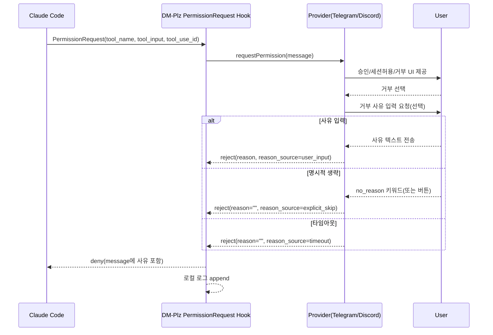
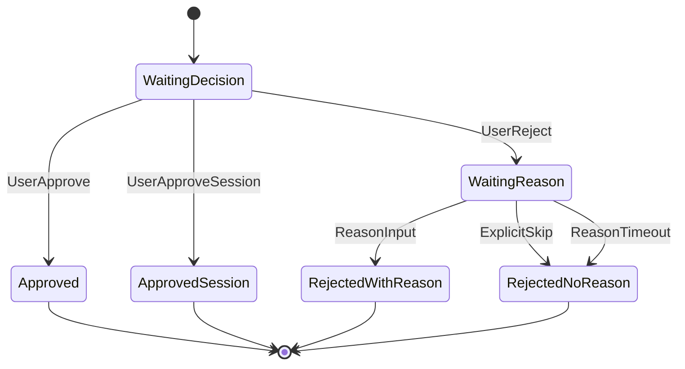

# DM-Plz 권한 요청 거부 사유 입력/피드백 로깅 PRD

- 문서 버전: v0.3
- 작성일: 2026-01-15
- 상태: Draft
- 대상 저장소: `DM-plz`

## 0. 변경 이력
- v0.3: 만료/늦은 입력(late response) 정책 추가, Discord 사유 생략 키워드 혼동 방지, 로그 마스킹/로테이션/동시성(락) 요구사항 보강, QA 체크리스트 구체화
- v0.2: 타임아웃 상한(훅 timeout) 명시, request_id 매핑/동시성 요구사항 보강, 로그 스키마/프라이버시 정책 구체화
- v0.1: 초안 작성

## 1. 배경 (Problem)
DM-Plz는 Claude Code의 `PermissionRequest` 훅을 Telegram/Discord로 라우팅해 사용자가 원격에서 승인/거부를 결정할 수 있게 한다.

현재 거부(Reject) 시나리오에서 아래 문제가 누적된다.

- **거부 사유 입력 UX가 불명확/비일관**: 사용자가 거부 의사를 표현해도, “사유를 지금 입력해야 하는지/입력 방법이 무엇인지/생략 가능한지”가 메시지 상에서 충분히 명시되지 않아 즉각 피드백 루프가 약해질 수 있다.
- **사유 생략이 ‘타임아웃’에 의존**: 사유가 선택 사항이라면, 사용자가 “사유 없이 거부”를 빠르게 확정할 수 있어야 한다.
- **거부 사유의 로컬 기록 부재**: 동일한 패턴의 거부가 반복될 때(예: 특정 도구는 항상 거부), 운영/개선 관점에서 정량/정성 데이터가 남지 않는다.
- **만료 이후 입력 혼란**: 훅 타임아웃 이후 사용자가 늦게 승인/거부를 입력했을 때, “반영되지 않은 조작”이 발생할 수 있다.

## 2. 목표 (Goals)
- 사용자가 Telegram/Discord 메시지에서 **거부를 선택했을 때 거부 사유를 즉시 입력**할 수 있게 한다.
- 거부 사유는 **선택 사항**으로 운영한다(사유 없이도 거부 확정 가능).
- 거부 결과는 Claude Code에게 **즉시 전달**되어, Claude가 다음 행동(대안 제시/추가 설명/중단 등)을 판단하는 데 활용할 수 있어야 한다.
- 거부 사유는 로컬에 **구조화 로그로 저장**되어 재현/분석이 가능해야 한다.
- 만료 이후 사용자의 입력에 대해 **명확한 사용자 피드백(만료됨)**을 제공한다.

## 3. 비목표 (Non-goals)
- `Stop` 훅(작업 종료 후 속행 질문)에서의 거부 사유 수집.
- `AskUserQuestion`(질문 옵션 선택)에서 “거부 옵션 선택 시 추가 사유 입력” 같은 커스텀 로직.
- Discord Interaction 기반 버튼/모달(Modal) UI로의 전환(현재 DM-Plz는 REST + 폴링 중심 아키텍처).
- 거부 사유 자동 분류/요약/LLM 기반 분석.

## 4. 범위 (Scope)
- Claude Code 훅 이벤트 중 **`PermissionRequest`** 만 대상으로 한다.
- DM-Plz MCP 서버의 **Telegram/Discord provider의 권한 요청 UX** 및 **permission-hook의 출력 메시지 구성**, **로컬 로그 저장**을 포함한다.

## 5. 현행(As-Is) 동작 요약
### 5.1 Claude Code 훅 구조
- Claude Code가 권한이 필요한 도구 실행 시 `PermissionRequest` 훅이 실행된다.
- DM-Plz는 해당 훅 입력을 받아 Telegram/Discord로 승인/거부를 요청한다.

### 5.2 DM-Plz의 권한 요청 흐름(코드 근거)
- 권한 요청 훅 엔트리: `server/src/permission-hook.ts`
- Telegram 권한 요청: `server/src/providers/telegram.ts`의 `requestPermission`
- Discord 권한 요청: `server/src/providers/discord.ts`의 `requestPermission`
- 거부 응답 타입: `server/src/types.ts`의 `PermissionResponse`

## 6. 제약/가정 (Constraints & Assumptions)

### 6.1 플랫폼 제약
- Telegram: 인라인 키보드(`callback_query`) 기반 상호작용이 주된 UI.
- Discord: 현재 구현은 메시지 “리액션(✅/🔄/❌)”과 이후 텍스트 입력 폴링 중심.

### 6.2 타임아웃 제약(상한 포함)
- 권한 요청 전체 대기 시간은 `DMPLZ_QUESTION_TIMEOUT_MS`(환경변수)에 의해 제한된다.
- 거부 사유 입력 대기 시간은 별도 타임아웃(`DMPLZ_REJECT_REASON_TIMEOUT_MS`)을 둔다.
- **상한(중요)**: 훅 자체의 최대 실행 시간은 Claude Code 훅 설정에 의해 제한된다.
  - 예: `.claude-plugin/plugin.json`에서 `PermissionRequest` 훅 timeout이 `300000ms`로 설정되어 있으면, 권한 요청 + 사유 입력 + 후처리(로그 저장) 전체가 5분 내에 끝나야 한다.

**정책(권장)**
- `DMPLZ_REJECT_REASON_TIMEOUT_MS`는 `PermissionRequest` 훅 timeout보다 충분히 작아야 한다(안전 마진 포함).
- 더 긴 대기(예: 10분)를 지원하려면 `.claude-plugin/plugin.json`의 훅 timeout도 함께 조정해야 한다.

### 6.3 민감정보 취급
- 거부 사유/권한 요청 메시지에는 사용자가 민감정보를 입력할 가능성이 있으므로, 로컬 로그에는 저장 범위를 제한해야 한다.

### 6.4 만료 이후 입력(Late Response)
- 훅 timeout 또는 권한 요청 timeout 이후, 사용자는 메신저에서 늦게 반응/메시지를 보낼 수 있다.
- 이때 “사용자는 처리됐다고 믿지만 실제로는 처리되지 않음”이 발생하지 않도록 만료 피드백이 필요하다.

## 7. 개선안(To-Be) 요약
### 7.1 핵심 변경점
- 거부 선택 이후, 곧바로 **“거부 사유 입력(선택)”** 단계로 진입한다.
- 사용자는 아래 중 하나로 거부를 완료할 수 있다.
  - 거부 사유 텍스트 입력
  - “사유 없이 거부” 선택(명시적)
  - 타임아웃으로 “사유 없음” 처리(암묵적)

### 7.2 거부 사유의 활용
- **Claude에 전달**: `PermissionRequest` 훅의 deny 메시지로 전달.
- **로컬 저장**: 파일(JSONL)로 append 저장.

## 8. 사용자 시나리오 (User Stories)
### 8.1 Telegram
1) Claude가 권한 요청을 발생시킨다.
2) 사용자는 Telegram에서 `❌ 거부`를 누른다.
3) 봇은 “거부 사유를 입력해주세요(선택)”를 안내하고, (a) 텍스트 입력 또는 (b) ‘사유 없이 거부’ 중 선택을 받는다.
4) 선택 결과가 Claude Code로 전달되고, 로컬 로그에 저장된다.

### 8.2 Discord
1) Claude가 권한 요청을 발생시킨다.
2) 사용자는 Discord에서 `❌` 리액션을 남긴다.
3) 봇은 “거부 사유를 입력해주세요(선택). 사유 없이 거부하려면 …”을 안내한다.
4) 사용자의 텍스트 응답(또는 생략)이 Claude Code로 전달되고, 로컬 로그에 저장된다.

## 9. 기능 요구사항 (Functional Requirements)

### FR-1. 거부 시 사유 입력을 유도한다
- Telegram/Discord 모두 거부 선택 직후, 별도의 안내 메시지로 “거부 사유 입력(선택)”을 명확히 고지한다.
- 안내 메시지에는 **입력 방법**, **시간 제한**, **생략 방법**이 포함되어야 한다.

**수용 기준(Acceptance Criteria)**
- 사용자가 거부를 선택하면 1회 이상 사유 입력 안내가 표시된다.
- 안내 메시지에 “선택 사항”임이 명시된다.

### FR-2. 사유 없이 거부(명시적) 경로를 제공한다
- 사용자가 타임아웃을 기다리지 않고 즉시 거부를 확정할 수 있어야 한다.

**제안 UX (플랫폼별)**
- Telegram: “사유 없이 거부” 버튼 제공(인라인 키보드).
- Discord: 사유 입력 안내 메시지에서 “사유 없이 거부하려면 `<키워드>`를 입력” 같은 텍스트 가이드 제공.

**혼동 방지 정책(권장)**
- Discord에서 키워드는 `skip`처럼 “행동 자체를 스킵”으로 오해될 수 있는 단어보다,
  - `no_reason`
  - `n/a`
  - `-`
  같은 “사유 없음” 맥락이 명확한 키워드를 우선 고려한다.
- 키워드 파싱은 **사유 입력 대기 상태(WaitingReason)** 에서만 유효해야 한다(다른 상태에서 키워드 입력은 무시).

**수용 기준**
- 사용자가 5초 내에 사유 없이 거부를 확정할 수 있다(타임아웃 대기 불필요).

### FR-3. 사유 입력 타임아웃 처리
- 사유 입력 대기 시간이 초과되면 “사유 없음(타임아웃)”으로 처리하고 거부를 확정한다.

**수용 기준**
- 타임아웃이 발생해도 최종 결과는 `deny`로 처리된다.
- Claude Code에 전달되는 메시지에 “사유 없음(타임아웃)”이 구분되어 표시된다.

### FR-4. Claude Code로 거부 사유를 전달한다
- `PermissionRequest` 훅 출력에서 deny 메시지에 거부 사유가 포함되어야 한다.

**메시지 규칙(권장)**
- 사유 입력됨: `User rejected the request. Reason: <reason>`
- 사유 없음(명시적 생략): `User rejected the request. (No reason provided)`
- 사유 없음(타임아웃): `User rejected the request. (No reason provided: timeout)`

**수용 기준**
- Claude가 거부 사유를 읽을 수 있는 단일 문자열로 전달된다.

### FR-5. 입력값 정규화/안전 처리
- 거부 사유는 다음 정책으로 정규화한다.
  - 최대 길이 제한(초과분 절단)
  - 줄바꿈/따옴표 등 특수문자는 Claude Code 훅 출력(JSON) 및 로그(JSONL)를 깨지 않도록 안전하게 처리
  - “사유 없음 키워드”는 trim/lowercase 등 정규화 후 비교

**수용 기준**
- 거부 사유에 줄바꿈/따옴표/이모지 등이 포함되어도 훅 출력(JSON)이 깨지지 않는다.

### FR-6. 로컬 로그를 저장한다
- 거부 이벤트 발생 시, 로컬에 구조화된 로그를 남긴다.

**로그 포맷(권장: JSONL, 1라인=1이벤트)**
- 저장 필드(최소)
  - `timestamp` (ISO8601)
  - `provider` (`telegram` | `discord`)
  - `decision` (`deny`)
  - `request_id` (가능하면 `tool_use_id`, 없으면 내부 생성값)
  - `tool_name`
  - `cwd`
  - `reason` (없으면 빈 문자열)
  - `reason_source` (`user_input` | `explicit_skip` | `timeout`)

**예시(형식 예시이며 구현 코드가 아님)**
```json
{"timestamp":"2026-01-15T12:34:56Z","provider":"telegram","decision":"deny","request_id":"toolu_01ABC...","tool_name":"Bash","cwd":"/repo","reason":"지금은 실행하지 말아줘","reason_source":"user_input"}
```

**민감정보 정책(강화)**
- 기본값으로 `tool_input` 전체를 저장하지 않는다.
- “거부 사유”에도 토큰/패스워드 등이 들어갈 수 있으므로, 아래 중 하나를 택해 정책화한다.
  - (권장) 사유는 원문 저장하되, 일반적인 secret 패턴을 간단히 마스킹한다.
  - (보수적) 사유는 원문 저장하지 않고 길이/해시만 저장한다.

### FR-7. 로그 보존/로테이션 정책
- 로그 파일은 무한히 커지지 않도록 로테이션/보존 정책을 둔다.

**수용 기준**
- 장기간 사용 시에도 로그 파일이 무한히 증가하지 않는다.

### FR-8. 만료 이후 입력(Late Response) 처리
- 요청이 만료(훅 timeout/권한 요청 timeout)된 이후 들어오는 입력은 **상태를 변경하지 않는다**.
- 사용자에게 “이 요청은 만료되었다”는 피드백을 제공한다.

**플랫폼별 권장 UX**
- Telegram: 가능하면 인라인 버튼 제거/비활성화(edit) + “만료됨” 문구 표시.
- Discord: 원본 메시지 또는 사유 요청 메시지에 “만료됨” 문구를 추가(edit)하고, 이후 입력이 오면 “만료됨” 안내 메시지를 1회 전송.

**수용 기준**
- 만료 이후 입력이 ‘승인’으로 잘못 반영되지 않는다.
- 사용자는 만료 사실을 즉시 인지할 수 있다.

### FR-9. 설정(환경변수) 지원
- 아래 설정을 환경변수로 제공한다.

**권장 설정 목록**
- `DMPLZ_REJECT_REASON_TIMEOUT_MS` (권장 기본: 60000)
- `DMPLZ_REJECT_REASON_MAX_CHARS` (기본: 300)
- `DMPLZ_REJECT_REASON_LOG_PATH` (기본: `~/.claude/dm-plz/rejections.jsonl`)
- `DMPLZ_REJECT_REASON_NO_REASON_KEYWORDS` (기본: `no_reason,n/a,-`)

**수용 기준**
- 설정 미지정 시 기본값으로 동작한다.

## 10. 비기능 요구사항 (Non-Functional Requirements)

### NFR-1. 신뢰성
- 네트워크 오류/플랫폼 API 오류가 발생하더라도, 시스템이 “승인/거부가 어떻게 처리되었는지”를 일관되게 기록/표시해야 한다.

### NFR-2. 보안/개인정보
- 로그는 기본적으로 민감 정보(토큰/비밀번호/키 등)를 저장하지 않도록 설계한다.
- 입력된 사유를 시스템이 다시 “명령”으로 해석하지 않도록, 사유는 단순 문자열로만 취급한다.

### NFR-3. 호환성
- 기존 승인/거부/세션허용 결정 로직은 그대로 유지한다.
- 기존 `PermissionResponse` 타입과 호환되어야 한다.

## 11. 플로우(Flow)

### 11.1 시퀀스(공통)


### 11.2 상태(State) 개념(권장)


### 11.3 request_id ↔ message_id 매핑 및 동시성 제어
- 목적: “사유 입력 단계에서 들어온 텍스트”가 어떤 권한 요청의 사유인지 **결정적으로 매칭**해야 한다.

**요구사항**
- 요청마다 `request_id`를 가진다(가능하면 `tool_use_id`).
- provider는 아래 중 하나(또는 조합)로 사유 입력을 매칭한다.
  - Telegram: 권한 요청 메시지 `message_id` 일치 + 사유 프롬프트 메시지 이후의 텍스트만 수용
  - Discord: 권한 요청 메시지 `message_id`에 대한 `❌` 리액션 감지 + 사유 프롬프트 이후의 메시지만 수용

**동시성 제어(권장)**
- 사용자(User/Chat) 단위로 “동시에 활성화된 PermissionRequest는 1개”로 제한하는 **락(User Lock)** 을 고려한다.
  - 대안: 큐(Queue)로 순차 처리

## 12. 예외/엣지 케이스
- 동시 권한 요청
- 다른 채팅/채널 입력
- 사유 과다 길이
- 사용자가 거부 후 다른 반응 추가(Discord)
- 훅 timeout 초과

## 13. 측정/모니터링 (Metrics)
- 거부율, 사유 입력률, 명시적 생략률, 타임아웃률, 훅 timeout률

## 14. QA 체크리스트 (Manual)
- Telegram
  - 승인/세션허용/거부 버튼 동작
  - 거부 후 사유 입력 안내 표시
  - 사유 입력 시 deny 메시지에 사유 포함
  - 사유 없음(버튼)으로 즉시 거부 확정
  - 사유 입력 타임아웃 시 deny 처리
  - 만료 이후 버튼 클릭 시 “만료됨” 안내
- Discord
  - ✅/🔄/❌ 리액션 동작
  - ❌ 후 사유 입력 안내 표시
  - `no_reason` 키워드 입력 시 즉시 거부 확정
  - 사유 입력 타임아웃 시 deny 처리
  - 만료 이후 입력/리액션에 “만료됨” 안내
- 안전성
  - 사유에 `"`, `\`, 줄바꿈, 이모지 포함 시 훅 출력(JSON) 및 로그(JSONL) 파싱 가능
- 로깅
  - 거부 시 JSONL 1줄 append
  - 로그 마스킹 정책이 기대대로 적용
  - 로테이션 정책이 동작
- 동시성
  - 2개 요청이 동시에 도착해도 사유 매칭이 꼬이지 않음(락/큐 정책 포함)

## 15. TODO (상세)
- Discord ‘사유 없음’ 키워드 최종 확정(권장: `no_reason,n/a,-`)
- 만료 이후 입력 UX 문구 확정(한국어/영어)
- 로그 프라이버시 정책 선택(원문+마스킹 vs 해시)
- 로테이션 정책 확정(일 단위/용량 단위/보관 기간)
- User Lock/Queue 적용 여부 확정

## 16. 참고 (공식 문서)
- Claude Code Hooks Reference (PermissionRequest / Hook Output): https://docs.anthropic.com/en/docs/claude-code/hooks
- Telegram Bot API: https://core.telegram.org/bots/api
- Discord API Docs (Discord 공식 docs 저장소)
  - https://raw.githubusercontent.com/discord/discord-api-docs/main/docs/resources/channel.mdx
  - https://raw.githubusercontent.com/discord/discord-api-docs/main/docs/resources/message.mdx
  - https://raw.githubusercontent.com/discord/discord-api-docs/main/docs/topics/oauth2.mdx
- Model Context Protocol(MCP): https://modelcontextprotocol.io/introduction
