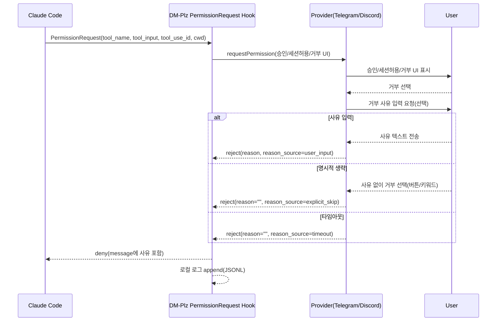
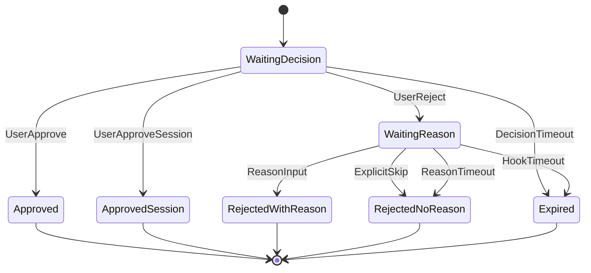

# DM-Plz 권한 요청 거부 사유 입력/피드백 로깅 스펙

- 문서 버전: v0.1
- 작성일: 2026-01-15
- 기준 PRD: `docs/dmplz-reject-reason-prd.md`
- 대상 저장소: `DM-plz`

## 1. 배경 및 목표

### 1.1 배경(Problem)
`PermissionRequest` 훅에서 사용자가 권한을 거부(deny)할 때,
- 거부 사유 입력 UX가 불명확/비일관
- 사유 생략이 타임아웃에 의존
- 거부 사유의 로컬 기록 부재
- 만료 이후(late response) 입력 혼란

이 문제를 개선하기 위해 “거부 → (선택) 사유 입력/생략 → deny 전달 + 로컬 로깅” 흐름을 표준화한다.

### 1.2 목표(Goals)
- Telegram/Discord에서 **거부 선택 직후 거부 사유 입력(선택)** 단계를 제공한다.
- **사유 없이 거부(명시적)** 경로를 제공한다.
- 거부 결과(사유 포함)를 Claude Code로 **즉시 전달**한다.
- 거부 이벤트를 로컬에 **구조화 로그(JSONL)** 로 저장한다.
- 만료 이후 입력에 대해 **명확한 만료 피드백**을 제공하고 상태를 변경하지 않는다.

### 1.3 비목표(Non-goals)
- `Stop` 훅에서의 거부 사유 수집
- `AskUserQuestion`에서의 “거부 옵션 선택 시 추가 사유 입력” 같은 커스텀 로직
- Discord Interaction 기반 버튼/모달 UI 전환
- 거부 사유 자동 분류/요약/LLM 분석

## 2. 범위(Scope)
- 대상 훅 이벤트: **Claude Code `PermissionRequest`**
- 변경 범위
  - DM-Plz PermissionRequest 훅의 deny 메시지 구성
  - Telegram/Discord provider의 “거부 → 사유 입력(선택)” UX
  - 로컬 거부 로그 저장(마스킹/로테이션 포함)

## 3. 용어/구성요소
- Claude Code: 권한이 필요한 도구 실행 시 `PermissionRequest` 훅을 호출
- DM-Plz PermissionRequest Hook: 훅 입력을 받아 메신저로 승인/거부를 요청하고 훅 출력(JSON)을 반환
- Provider: Telegram/Discord로 메시지를 보내고 사용자 반응을 수집하는 컴포넌트
- request_id: 특정 권한 요청을 식별하는 값
  - 우선순위: `tool_use_id`(있으면 사용) → 내부 생성값
- Late Response(만료 이후 입력): 훅 timeout 또는 권한 요청 timeout 이후에 도착한 버튼/리액션/텍스트 입력

## 4. 제약사항(Constraints)

### 4.1 플랫폼 제약
- Telegram: 인라인 키보드(callback_query) 기반 상호작용
- Discord: 현재 아키텍처는 메시지 리액션(✅/🔄/❌) + 이후 텍스트 입력 폴링 중심

### 4.1.1 Discord 사전조건(메시지 내용 수집)
- DM-Plz는 Discord에서 사유 입력을 텍스트 메시지로 수집하므로, 봇이 메시지 내용을 읽을 수 있는 권한/설정이 필요하다.
- Discord 문서에는 `MESSAGE_CONTENT` privileged intent 미설정(또는 미승인) 시 메시지 객체의 `content` 등이 비어 있을 수 있음을 안내한다.
  - 참고: https://discord.com/developers/docs/resources/message#message-object

### 4.2 훅 timeout 상한
- `.claude-plugin/plugin.json`의 `PermissionRequest` 훅 timeout은 **300000ms(5분)** 으로 설정됨.
- 따라서 “권한 요청 대기 + 거부 사유 대기 + 후처리(로그 저장)”는 5분 내 종료되어야 함.
- 처리 과정에는 절대 데드라인이 존재하며, 데드라인 이후 도착한 입력은 모두 Late Response로 취급한다.
- 거부 사유 입력 대기 시간(`DMPLZ_REJECT_REASON_TIMEOUT_MS`)은 데드라인을 초과해 대기하지 않는다.

### 4.3 보안/프라이버시
- 거부 사유에는 토큰/비밀번호 등 민감정보가 포함될 수 있다.
- 로컬 로그는 기본적으로 **원문+마스킹** 정책을 적용한다.

## 5. 현행(As-Is) 동작 요약

### 5.1 공통
- PermissionRequest 훅은 provider로 승인/세션허용/거부를 요청하고 결과를 반환한다.

### 5.2 Telegram(현행)
- 인라인 버튼: `✅ 승인`, `🔄 세션 허용`, `❌ 거부`
- `❌ 거부` 선택 시 즉시 “거부 이유를 입력해주세요(5분 이내)” 안내 후 텍스트 입력을 대기
- “사유 없이 거부” 명시 경로/키워드 없음

### 5.3 Discord(현행)
- 메시지에 봇이 ✅/🔄/❌ 리액션을 추가
- 사용자가 ❌ 리액션 시 “거부 이유를 입력해주세요(5분 이내)” 메시지 전송 후 텍스트 입력을 폴링
- “사유 없이 거부” 명시 경로/키워드 없음

### 5.4 로깅(현행)
- 거부 이벤트에 대한 별도 JSONL 로깅 없음

## 6. 기능 요구사항(Functional Requirements)

> 본 섹션은 PRD의 FR-1~FR-9를 스펙으로 확정한 것이다.

### FR-1. 거부 시 사유 입력을 유도한다
- Telegram/Discord 모두 거부 선택 직후, 별도의 안내 메시지로 “거부 사유 입력(선택)”을 고지한다.
- 안내에는 다음이 포함되어야 한다.
  - 입력 방법
  - 시간 제한
  - 생략 방법

**수용 기준**
- 사용자가 거부를 선택하면 1회 이상 사유 입력 안내가 표시된다.
- 안내 메시지에 “선택 사항”임이 명시된다.

### FR-2. 사유 없이 거부(명시적) 경로를 제공한다
- 사용자는 타임아웃을 기다리지 않고 즉시 거부를 확정할 수 있어야 한다.

**플랫폼별 정책(확정)**
- Telegram: 인라인 키보드에 `사유 없이 거부` 버튼 제공
- Discord: 사유 입력 대기 상태에서 `DMPLZ_REJECT_REASON_NO_REASON_KEYWORDS`에 포함된 키워드 입력 시 즉시 거부 확정 (기본: `no_reason`)

**수용 기준**
- 사용자가 5초 내에 사유 없이 거부를 확정할 수 있다.

### FR-3. 사유 입력 타임아웃 처리
- 사유 입력 대기 시간이 초과되면 “사유 없음(타임아웃)”으로 처리하고 거부를 확정한다.

**수용 기준**
- 타임아웃이 발생해도 최종 결과는 `deny`로 처리된다.
- Claude Code에 전달되는 메시지에서 “사유 없음(타임아웃)”이 구분된다.

### FR-4. Claude Code로 거부 사유를 전달한다
- PermissionRequest 훅 출력의 deny 메시지는 **영어**로 표준화한다.

**메시지 규칙(확정)**
- 사유 입력됨: `User rejected the request. Reason: <reason>`
- 사유 없음(명시적 생략): `User rejected the request. (No reason provided)`
- 사유 없음(타임아웃): `User rejected the request. (No reason provided: timeout)`

**수용 기준**
- Claude가 거부 사유를 읽을 수 있는 단일 문자열로 전달된다.

### FR-5. 입력값 정규화/안전 처리
- 거부 사유는 다음 정책으로 정규화한다.
  - trim(공백 제거)
  - 최대 길이 제한(초과분 절단): `DMPLZ_REJECT_REASON_MAX_CHARS`
  - JSON 출력/로그(JSONL)를 깨지 않도록 안전하게 직렬화
  - “사유 없음 키워드” 비교는 trim/lowercase 후 수행

**수용 기준**
- 거부 사유에 줄바꿈/따옴표/이모지 등이 포함되어도 훅 출력(JSON)과 로그(JSONL)가 파싱 가능하다.

### FR-6. 로컬 로그를 저장한다
- 거부 이벤트 발생 시, 로컬에 구조화 로그(JSONL) 1라인을 append 한다.
- `tool_input` 전체는 기본적으로 저장하지 않는다.

**로그 스키마(최소 필드)**
- `timestamp` (ISO8601)
- `provider` (`telegram` | `discord`)
- `decision` (`deny`)
- `request_id` (가능하면 `tool_use_id`)
- `tool_name`
- `cwd`
- `reason` (없으면 빈 문자열)
- `reason_source` (`user_input` | `explicit_skip` | `timeout`)

### FR-7. 로그 보존/로테이션 정책
- 로그 파일은 무한히 커지지 않도록 **용량 기반 로테이션**을 적용한다.

**정책(확정)**
- 기준 파일이 `DMPLZ_REJECT_REASON_LOG_ROTATE_BYTES`를 초과하면 rotate한다.
- rotate된 파일은 최대 `DMPLZ_REJECT_REASON_LOG_MAX_FILES`개까지 보관한다.

### FR-8. 만료 이후 입력(Late Response) 처리
- 요청이 만료(훅 timeout/권한 요청 timeout)된 이후 들어오는 입력은 **상태를 변경하지 않는다**.
- 사용자에게 “만료됨” 피드백을 제공한다.

**플랫폼별 UX**
- Telegram: 가능하면 인라인 버튼 제거/비활성화(edit) + “만료됨” 문구 표시
- Discord: 가능하면 원본 메시지(또는 사유 요청 메시지)에 “만료됨” 문구를 추가(edit)하고, 이후 입력이 오면 “만료됨” 안내를 1회 전송

### FR-9. 설정(환경변수) 지원
- 본 기능에 필요한 설정을 환경변수로 제공한다(기본값 포함).

## 7. 사용자 경험(UX) 및 플로우

### 7.1 공통 UX 원칙
- 메신저 안내 문구는 **한국어**로 제공한다.
- 사유 입력은 **선택**이며, 명시적 생략 경로를 반드시 제공한다.

### 7.2 Telegram UX
- 거부(❌) 클릭 직후
  - 안내 메시지(한국어):
    - “거부 사유를 입력해주세요 (선택).”
    - “사유 없이 거부하려면 ‘사유 없이 거부’ 버튼을 누르세요.”
    - “시간 제한: <DMPLZ_REJECT_REASON_TIMEOUT_MS>ms”
  - 인라인 키보드:
    - `사유 없이 거부`
- 사유 텍스트 입력은 “사유 안내 메시지 이후의 텍스트”만 수용한다.

### 7.3 Discord UX
- 사용자가 ❌ 리액션을 남기면
  - 안내 메시지(한국어):
    - “거부 사유를 입력해주세요 (선택).”
    - “사유 없이 거부하려면 `no_reason` 를 입력하세요.”
      - 안내 메시지에 표시하는 키워드는 `DMPLZ_REJECT_REASON_NO_REASON_KEYWORDS`의 첫 번째 값(대표 키워드)을 사용한다. (기본: `no_reason`)
    - “시간 제한: <DMPLZ_REJECT_REASON_TIMEOUT_MS>ms”
- 사유 텍스트 입력은 아래 조건을 만족하는 “사유 안내 메시지 이후의 메시지”만 수용한다.
  - 동일 채널
  - 봇이 아닌 사용자
  - ❌ 리액션을 남긴 사용자

### 7.4 만료(Late Response) UX
- 만료 이후 입력 발생 시 1회 안내(한국어):
  - “이 권한 요청은 이미 만료되었습니다. (request_id: <id>)”

## 8. 시스템 설계 및 상태 모델

### 8.1 시퀀스(공통)

### 8.2 상태(State) 모델

### 8.3 request_id ↔ message_id 매핑
- `request_id`는 요청 단위로 고정된다.
- Telegram
  - 권한 요청 메시지 `message_id`와 callback_query의 `message_id`를 일치시켜 decision을 매칭한다.
  - 사유 입력은 “사유 안내 메시지 이후의 메시지”만 수용한다.
- Discord
  - 권한 요청 메시지 `message_id`에 대한 ❌ 리액션을 감지한다.
  - 사유 입력은 “사유 안내 메시지 이후의 메시지”만 수용한다.

### 8.4 동시성(User Lock) 정책
- 사용자(User/Chat) 단위로 **동시에 활성화된 PermissionRequest는 1개**로 제한한다.
- Lock 키(권장): `provider` + (`chat_id`/`channel_id`) + (가능하면 `user_id`) 조합
- Lock 대기 정책(권장): FIFO
- Lock이 이미 존재하는 동안 신규 PermissionRequest가 들어오면
  - 신규 요청은 lock이 해제될 때까지 대기한다.
  - 단, 대기는 훅 timeout(300000ms) 내에서만 허용되며, 데드라인을 넘기면 해당 요청을 `Expired` 처리한다.
- Lock 해제 조건: `Approved`/`ApprovedSession`/`Rejected*`/`Expired` 등 terminal 상태 전이 시 즉시 해제한다.

## 9. 데이터/로깅 설계

### 9.1 로그 파일 포맷
- 파일 포맷: JSONL (1라인=1이벤트)
- 기본 경로: `DMPLZ_REJECT_REASON_LOG_PATH` (기본값은 `~/.claude/dm-plz/rejections.jsonl`)
- 로그 경로의 상위 디렉토리가 존재하지 않으면 생성되어야 한다.

예시(형식 예시이며 구현 코드가 아님)
- `{ "timestamp":"...","provider":"telegram","decision":"deny","request_id":"toolu_...","tool_name":"Bash","cwd":"...","reason":"...","reason_source":"user_input" }`

### 9.2 마스킹 정책(원문+마스킹)
- 사유 문자열에서 일반적인 secret 패턴이 탐지되면 부분 마스킹한다.
- 마스킹 적용 예(개념):
  - `token=...`, `api_key=...`, `password: ...` 등 키-값 형태
  - 길이가 긴 base64/hex 토큰 형태 문자열

### 9.3 로테이션/보존(용량 기반)
- `DMPLZ_REJECT_REASON_LOG_ROTATE_BYTES` 초과 시 rotate
- rotate 파일은 최신 `DMPLZ_REJECT_REASON_LOG_MAX_FILES`개만 보관
- 보관 개수 초과 시 가장 오래된 rotate 파일부터 삭제

### 9.4 로그 기록 동시성
- PermissionRequest 훅은 프로세스 단위로 병렬 실행될 수 있으므로,
  - JSONL append는 레이스 없이 기록되어야 한다.
  - append와 rotate는 **동일한 프로세스 간 락 범위**에서 수행되어야 한다.
- 락을 획득하지 못하거나 로그 기록이 실패하더라도, 권한 결정(deny) 자체는 영향받지 않는다.

## 10. 설정(환경변수)

### 10.1 본 기능 추가 환경변수(필수)
- `DMPLZ_REJECT_REASON_TIMEOUT_MS`
  - 기본값: `60000`
  - 제약: 훅 timeout(300000ms)보다 충분히 작아야 함(안전 마진 포함)
- `DMPLZ_REJECT_REASON_MAX_CHARS`
  - 기본값: `300`
- `DMPLZ_REJECT_REASON_LOG_PATH`
  - 기본값: `~/.claude/dm-plz/rejections.jsonl`
- `DMPLZ_REJECT_REASON_NO_REASON_KEYWORDS`
  - 기본값: `no_reason`
  - 형식: 쉼표(,)로 구분된 키워드 목록 (예: `no_reason,n/a,-`)

### 10.2 로테이션 관련 환경변수(권장)
- `DMPLZ_REJECT_REASON_LOG_ROTATE_BYTES`
  - 기본값: `10485760` (10MB)
- `DMPLZ_REJECT_REASON_LOG_MAX_FILES`
  - 기본값: `10`

### 10.3 기존 환경변수(관련)
- `DMPLZ_QUESTION_TIMEOUT_MS`
  - 권한 요청 전체 대기 시간(거부 사유 단계 포함)에 영향

## 11. 예외/엣지 케이스 및 Fail-safe

### 11.1 로깅 실패
- 로그 append/rotate 실패가 발생해도 **권한 결정(deny)은 변하지 않는다**.
- 사용자 UX는 정상 흐름을 우선한다(거부 확정/만료 안내 등).

### 11.2 네트워크/플랫폼 오류
- Telegram/Discord API 오류가 발생하더라도,
  - deny/allow 결과가 어떻게 되었는지 일관되게 처리되어야 한다.
  - 필요 시 “사유 입력 실패 → 사유 없음 처리”로 수렴한다.

### 11.3 입력 관련
- 사유 과다 길이(절단)
- 다른 채팅/채널의 입력(무시)
- WaitingReason이 아닌 상태에서 `DMPLZ_REJECT_REASON_NO_REASON_KEYWORDS`에 해당하는 키워드 입력(무시)

## 12. 측정/모니터링(Metrics)
- 거부율
- 사유 입력률
- 명시적 생략률(`explicit_skip`)
- 타임아웃률(`timeout`)
- 훅 timeout률

## 13. QA 체크리스트(Manual)

### 13.1 Telegram
- 승인/세션허용/거부 버튼 동작
- 거부 후 사유 입력 안내 표시(선택 사항 명시)
- 사유 입력 시 deny 메시지에 사유 포함
- `사유 없이 거부` 버튼으로 즉시 거부 확정
- 사유 입력 타임아웃 시 deny 처리 + timeout 구분
- 만료 이후 버튼 클릭 시 “만료됨” 안내

### 13.2 Discord
- ✅/🔄/❌ 리액션 동작
- ❌ 후 사유 입력 안내 표시(선택 사항 명시)
- `DMPLZ_REJECT_REASON_NO_REASON_KEYWORDS`에 해당하는 키워드 입력 시 즉시 거부 확정 (기본: `no_reason`)
- 사유 입력 타임아웃 시 deny 처리 + timeout 구분
- 만료 이후 입력/리액션에 “만료됨” 안내

### 13.3 안전성
- 사유에 `"`, `\`, 줄바꿈, 이모지 포함 시 훅 출력(JSON) 및 로그(JSONL) 파싱 가능

### 13.4 로깅
- 거부 시 JSONL 1줄 append
- 마스킹 정책이 기대대로 적용
- 용량 기반 로테이션/보존 정책 동작

### 13.5 동시성
- 2개 요청이 동시에 도착해도 사유 매칭이 꼬이지 않음(User Lock)

## 14. 참고(공식 문서)
- Claude Code Hooks Reference: https://docs.anthropic.com/en/docs/claude-code/hooks
  - PermissionRequest decision control: https://docs.anthropic.com/en/docs/claude-code/hooks#permissionrequest-decision-control
- Telegram Bot API: https://core.telegram.org/bots/api
  - sendMessage: https://core.telegram.org/bots/api#sendmessage
  - editMessageText: https://core.telegram.org/bots/api#editmessagetext
  - answerCallbackQuery: https://core.telegram.org/bots/api#answercallbackquery
  - getUpdates: https://core.telegram.org/bots/api#getupdates
- Discord Developer Docs: https://discord.com/developers/docs
  - Channel resource: https://discord.com/developers/docs/resources/channel
  - Create Message: https://discord.com/developers/docs/resources/channel#create-message
  - Create Reaction: https://discord.com/developers/docs/resources/channel#create-reaction
  - Get Reactions: https://discord.com/developers/docs/resources/channel#get-reactions
  - Get Channel Messages: https://discord.com/developers/docs/resources/channel#get-channel-messages
  - Create DM: https://discord.com/developers/docs/resources/user#create-dm
- Model Context Protocol
  - Intro: https://modelcontextprotocol.io/introduction
  - SDKs: https://modelcontextprotocol.io/docs/sdk
  - TypeScript SDK: https://github.com/modelcontextprotocol/typescript-sdk
- Bun Docs: https://bun.sh/docs
- Node.js File system: https://nodejs.org/api/fs.html
